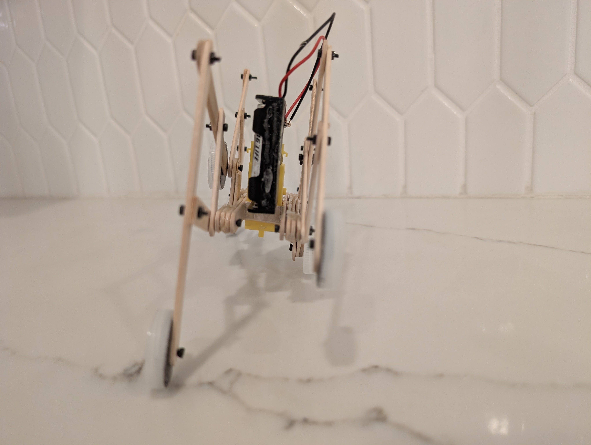

# Project Assignment 2: Design, Build and Simulate your Robot

#### Student: Shuai Gao, Lixiao Huang, Yibo Yuan

#### Instructor: Daniel Aukes (Fall 2025)

**The purpose of this assignment is to model, optimize, build, and validate your final robot.**

## Part 1: Define the System Model
Produce a final dynamic model in Mujoco that adapts the ideal kinematics of your initial robot model to your ȴnal geometry, material properties (joint stiffness and beam stiffness), and actuator characteristics. Ensure your model includes some aspect of material compliance / flexibility and motor behavior somewhere in your system, and that you have made it possible to vary at least one design parameter of interest and re-run the simulation in a function, for the purposes of wrapping this function in an optimization process. Plot expected performance of the model over a broad range of possible values, in a way that will be correlated to a real-life experiment.

The following codes carry out the simulation and plots. 

"""
from __future__ import annotations
import math
from typing import List

import numpy as np
import mujoco
import mediapy as media
import matplotlib.pyplot as plt

#this package is for animation of data
import matplotlib.animation as animation

import shutil

import shutil, os # this is to solve the mediapy.show_video failure

"""

## Demonstrating Robot Kinematics:

<iframe
    width="560"
    height="315"
    src="https://www.youtube.com/embed/h-qRB8NbPaI"
    title="Simulating Robot Kinematics"
    frameborder="0"
    allow="accelerometer; autoplay; clipboard-write; encrypted-media; gyroscope; picture-in-picture"
    allowfullscreen>
</iframe>

## Measuring Friction:

<iframe
    width="560"
    height="315"
    src="https://www.youtube.com/embed/GbdgqD_z7yU"
    title="Measuring Friction"
    frameborder="0"
    allow="accelerometer; autoplay; clipboard-write; encrypted-media; gyroscope; picture-in-picture"
    allowfullscreen>
</iframe>

## Downloading the .dxf file: 

[Download the layser cutting .dxf file](https://drive.google.com/file/d/1LF2AlNSIYC5J-23TM4jydFAAj1r5O-O3/view?usp=drive_link)

## Downloading the file making process instructions

[Download the file making instructions](Project%20Laser%20Cut.pdf)

## Laser Cut Robot Photos: 

